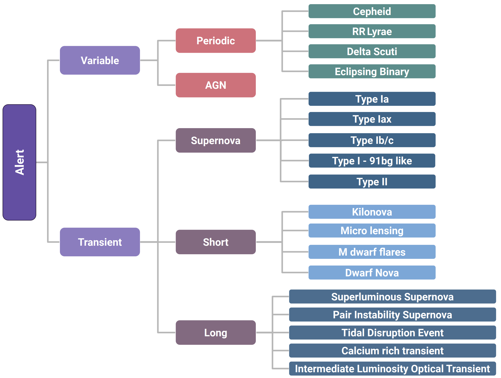
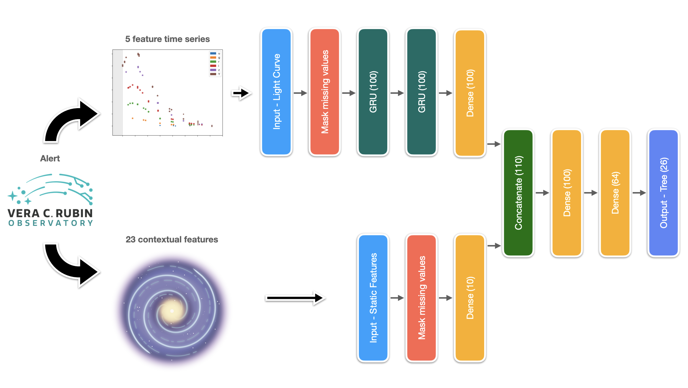
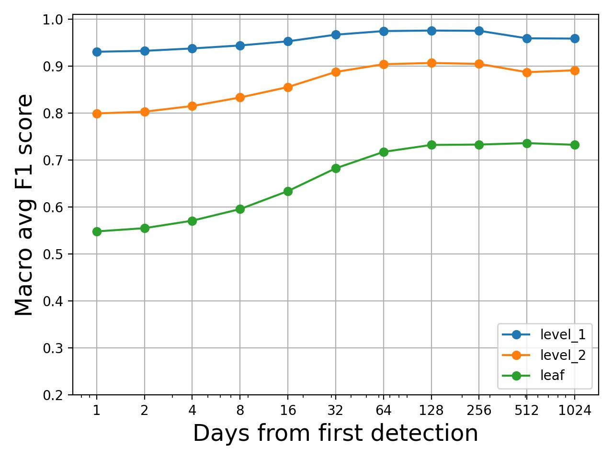
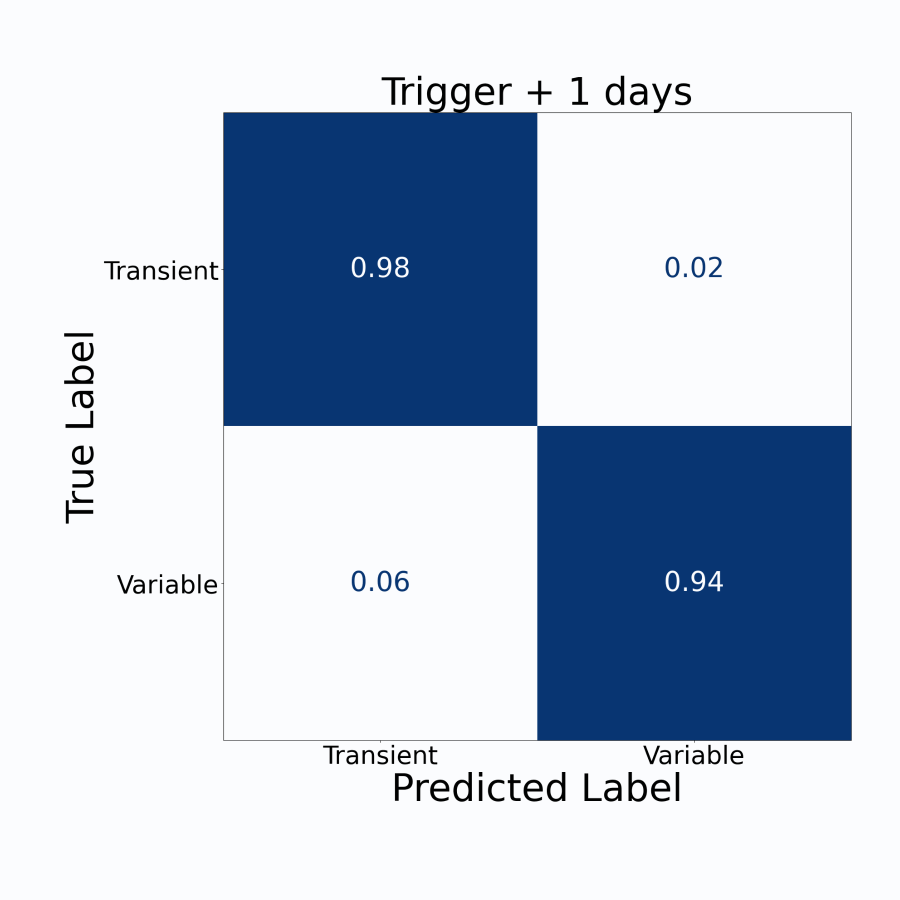
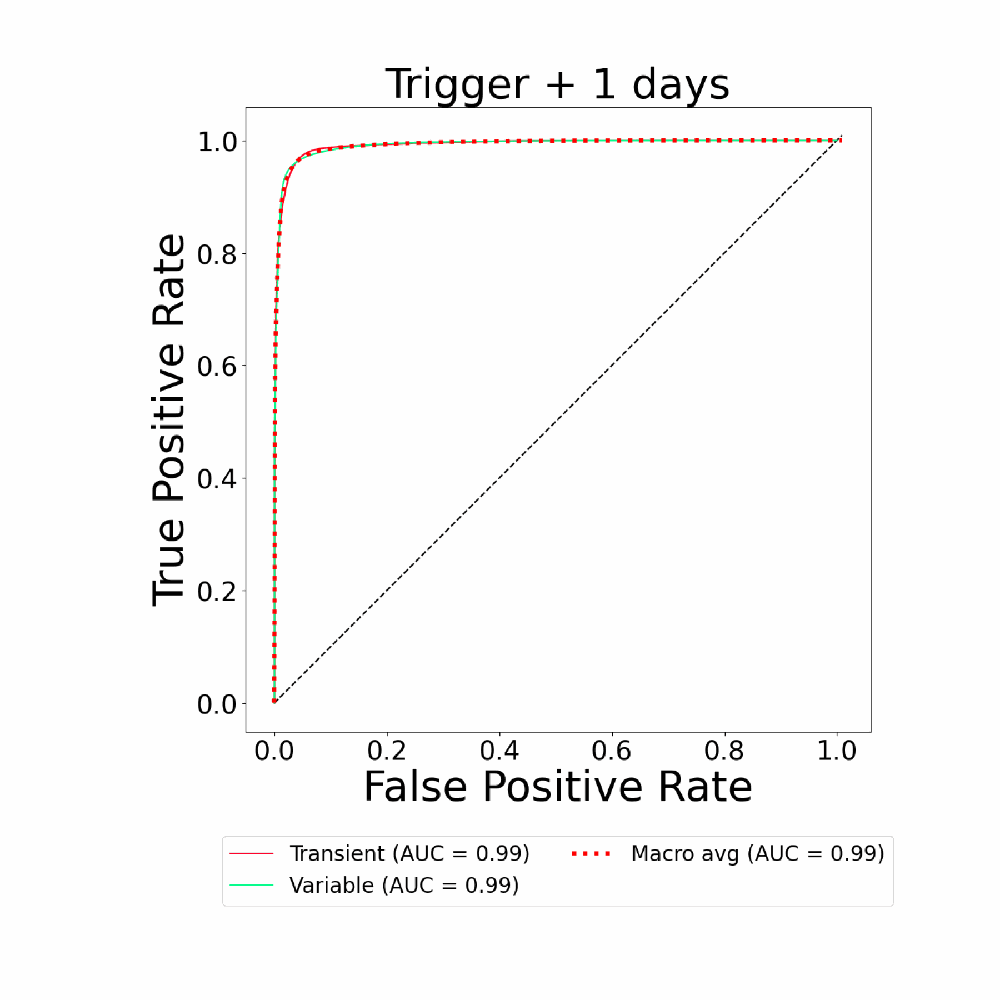
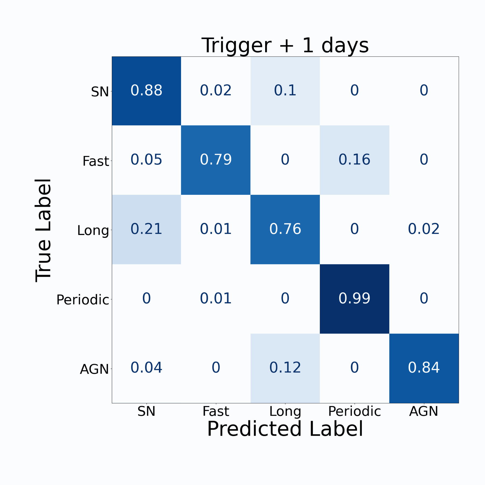
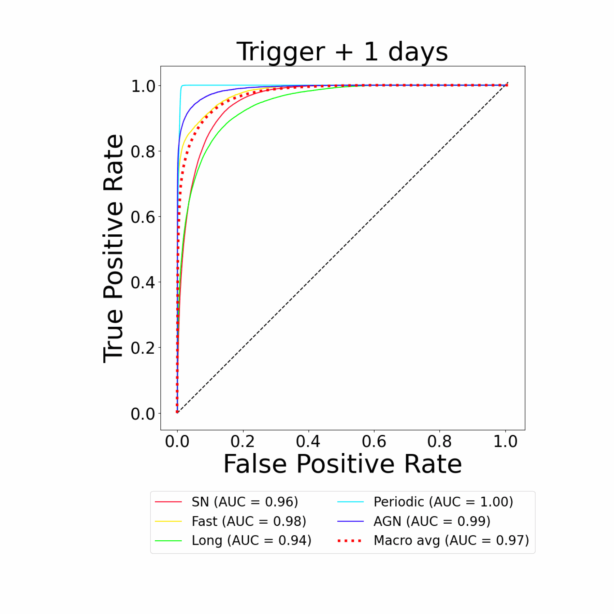
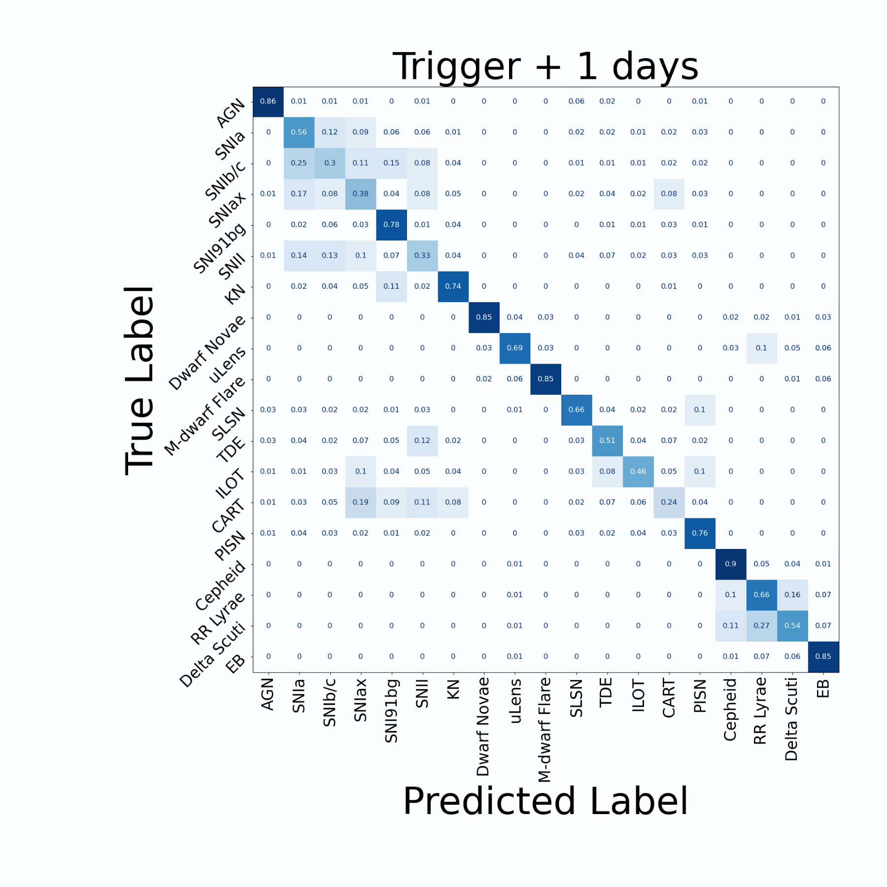
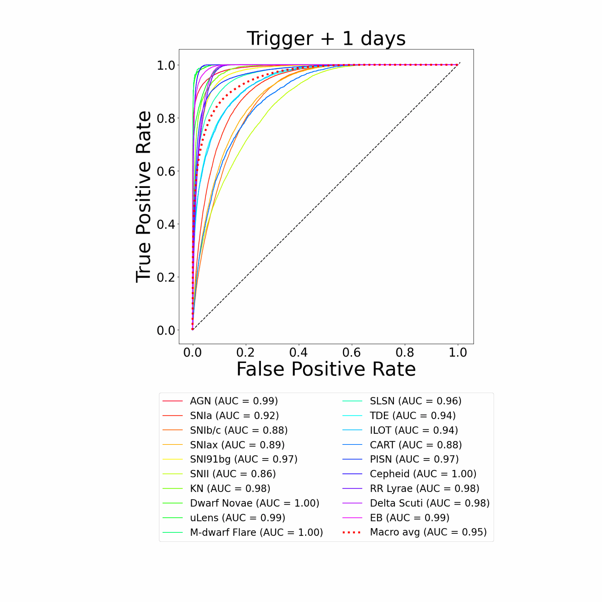

# ORACLE

 
 
 
> [!NOTE]  
> This is a complete rewrite of the original Oracle codebase using PyTorch, and is meant to supersede it. If you are looking for the original repository, you can find it [here](https://github.com/uiucsn/Astro-ORACLE/tree/main).

This repository contains the code and resources for both **ORACLE-1** and **ORACLE-2**.

<!-- > [!WARNING]  
> ⚠️ This is a warning banner. Be careful! -->

  

## ORACLE-1

ORACLE-1 is a hierarchical deep-learning model for real-time, context-aware classification of transient and variable astrophysical phenomena. ORACLE is a recurrent neural network with Gated Recurrent Units (GRUs), and has been trained using a custom hierarchical cross-entropy loss function to provide high-confidence classifications along an observationally-driven taxonomy with as little as a single photometric observation. Contextual information for each object, including host galaxy photometric redshift, offset, ellipticity and brightness, is concatenated to the light curve embedding and used to make a final prediction.

For more information, please read the our paper - https://ui.adsabs.harvard.edu/abs/2025arXiv250101496S/abstract

If you use any of this code in your own work, please cite the associated paper and software using the references in the [CITATION.cff](CITATION.cff) file.

## ORACLE-2

ORACLE-2 extends the original hierarchical classification framework to multimodal, real-time classification of transients and variables. The model family is designed to combine complementary information from multiple data sources:

* **ORACLE-2 Lite** uses light curves only, modeling the temporal evolution of each source.
* **ORACLE-2** combines light curves with tabular metadata to incorporate contextual information about the source.
* **ORACLE-2 Omni** combines light curves, metadata, and image cutouts to learn about the source and its local environment, including the surrounding host field.

These modalities play complementary roles throughout the evolution of an alert. Images and metadata can provide useful contextual information early, while the light curve supplies increasingly detailed information as more observations become available. The resulting models produce hierarchical classifications at different levels of granularity, supporting rapid triage and follow-up decisions on high-volume alert streams.

The ORACLE-2 models have also been demonstrated in real-time deployment on the Zwicky Transient Facility (ZTF) alert stream. For more information, see the [ORACLE-2 paper](https://arxiv.org/abs/2607.00228).

## Installation:

Please refer to the documentation [here](https://dev-ved30.github.io/Oracle/) for installation instructions.

## Repository structure

The repository contains the source code, data-processing tools, trained models, and analysis materials for both ORACLE-1 and ORACLE-2:

* `src/oracle/`: Core package code, including model architectures, training, testing, losses, taxonomies, dataset loaders, pretrained models, utilities, and visualization.
* `data/`: Datasets and prepared training, validation, and test splits.
* `models/`: Trained model checkpoints and experiment outputs for ORACLE-1 and ORACLE-2 variants.
* `scripts/`: Training, testing, hyperparameter sweep, data preparation, deployment, and documentation scripts.
* `notebooks/`: Exploratory analyses and scientific investigations.
* `paper_figures/`: Notebooks and intermediate outputs used to generate paper figures and tables.
* `figures/`: Figures used in the README and project documentation.
* `docs/`: Source and generated project documentation.
* Root-level files such as `pyproject.toml`, `CITATION.cff`, `LICENSE`, and `README.md`: Package metadata, citation information, licensing, and project documentation.

## ELAsTiCC data

The data used to train and evaluate the ELAsTiCC models are available in [this Google Drive folder](https://drive.google.com/drive/u/2/folders/1M28MSkyVPL-YcONiBcIWLw24xHLSOBw-). The repository’s `data/ELAsTiCC/` directory contains the corresponding locally prepared dataset files and train/validation/test splits.

# Classification Taxonomy

There is no universally correct classification taxonomy - however we want to build something that is able to best serve real world science cases. For obvious reasons, the leaf nodes need to be the true class of the object however what we decide for nodes higher up in the taxonomy is ultimately determined by the science case. 

For this work, we are implementing a hierarchy that will be of interest to the TVS (Transient and Variable star) community since it overlaps well with the classes of the elasticc data set. The exact taxonomy used is shown below:

A trap we wanted to avoid was mixing different "metaphors" for classification. For instance, we decided against using `Galactic vs Extra galactic` classification since we would be mixing a spatial distinction with temporal ones (like `Periodic vs Non periodic`). This makes the problem trickier since some objects, like Cepheids, can be both galactic and extragalactic which would result in an artificial inflation in the number of leaf nodes without adding much value to the science case.

*Note:* There is some inconsistency around the Mira/LPV object in the elasticc documentation however we have confirmed that this object was removed for the elasticc2 data set that we use in this work.

# Machine learning architecture

Once again, we have much more detailed discussion in the paper.

# Found Bugs?
We appreciate any support in the form of bug reports in order to provide the best possible experience. Bugs can be reported in the `Issues` tab.

# Contributing
If you like what we're doing and want to contribute to the project, please start by reaching out to the developer. We are happy to accept suggestions in the Issues tab. 

# Some cool results:

Overall model performance:

First at the root,

At the next level in the hierarchy

And finally, at the leaf...

## References:
* ORACLE-1 - https://arxiv.org/abs/2501.01496
* ORACLE-2 - https://arxiv.org/abs/2607.00228
* HXE Loss Function - https://arxiv.org/abs/1912.09393
* WHXE Loss Function - https://arxiv.org/abs/2312.02266
