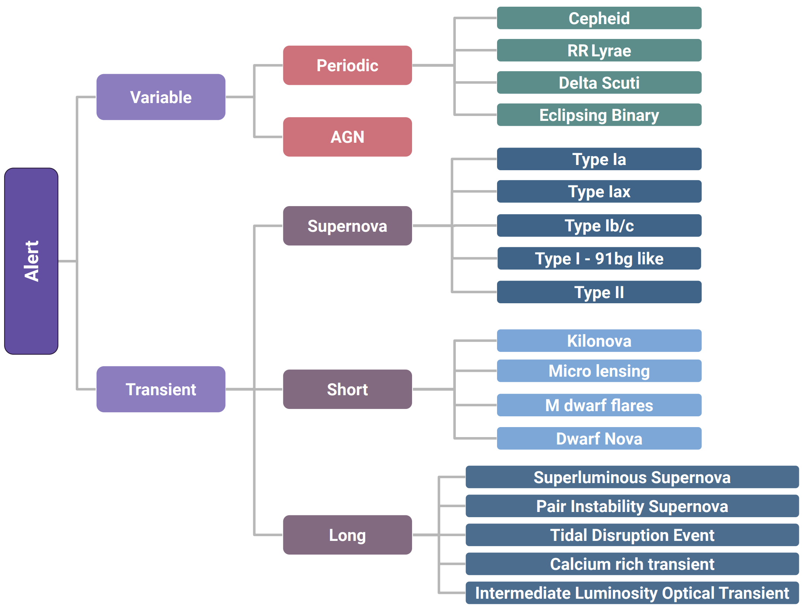
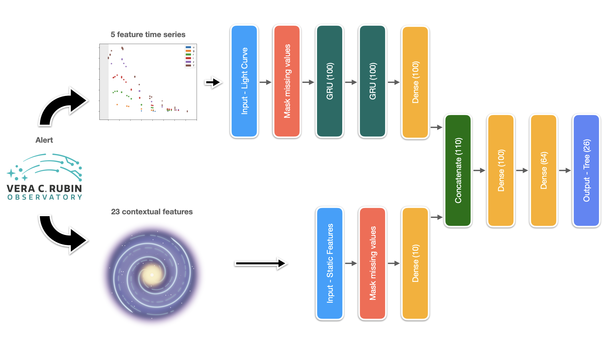
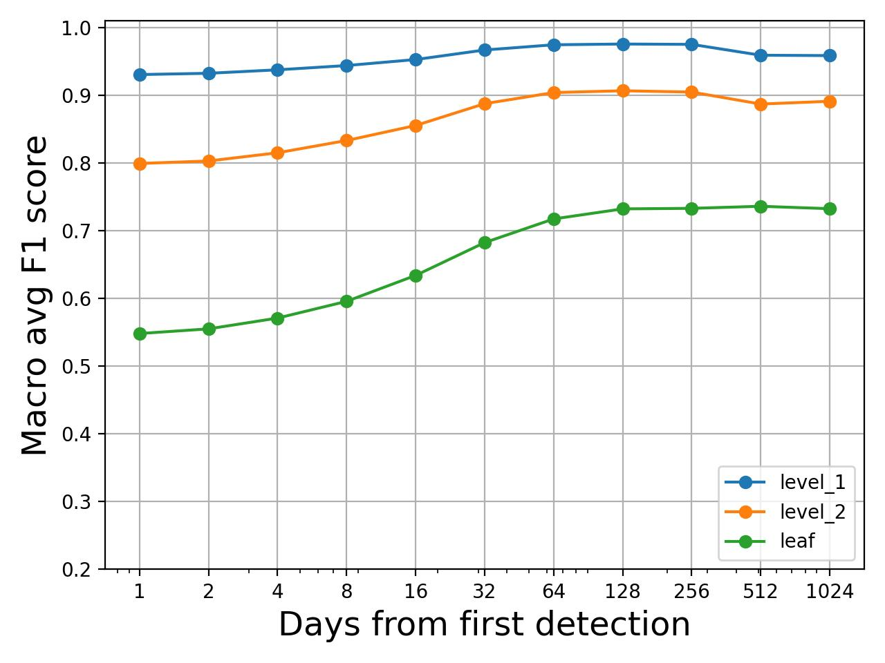
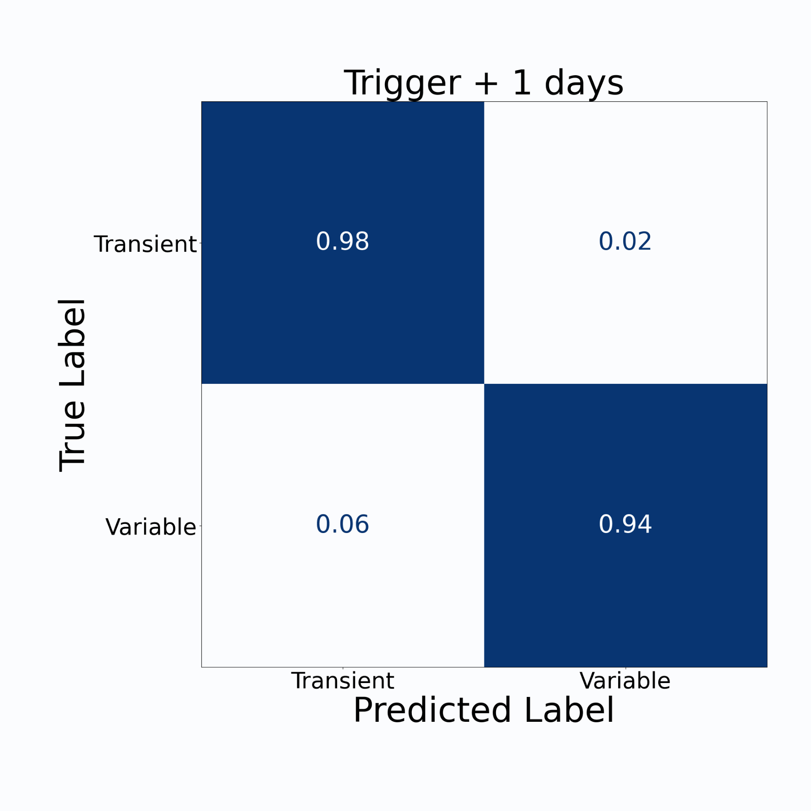
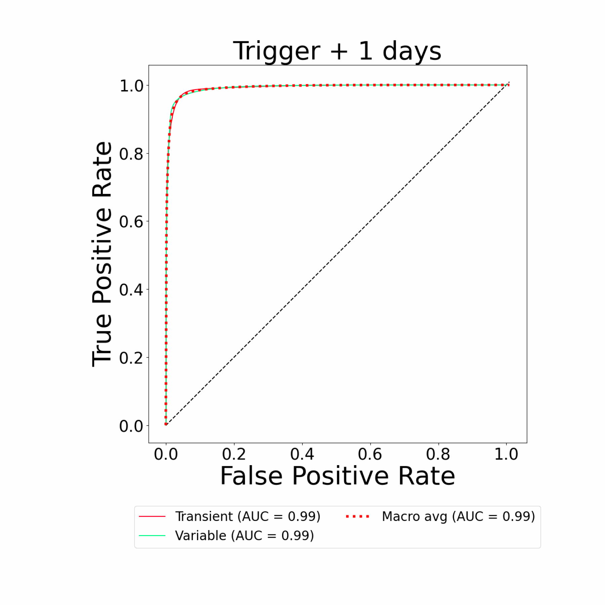
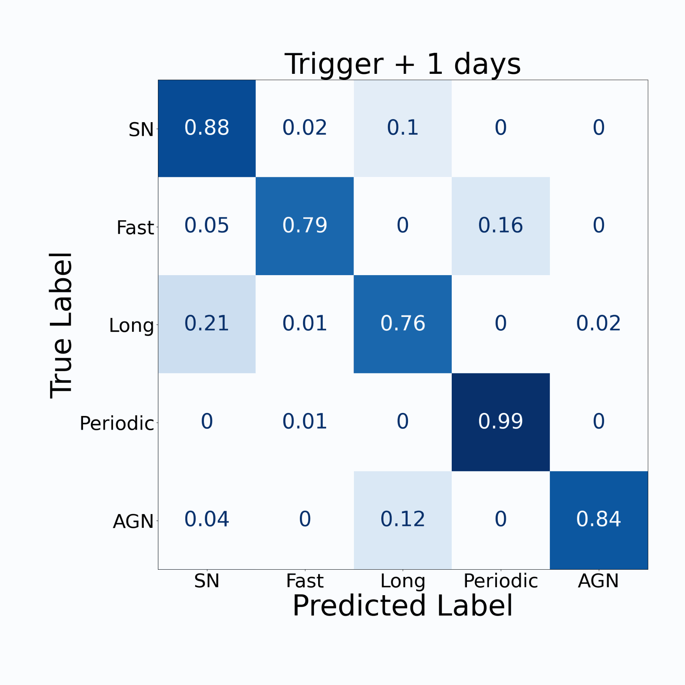
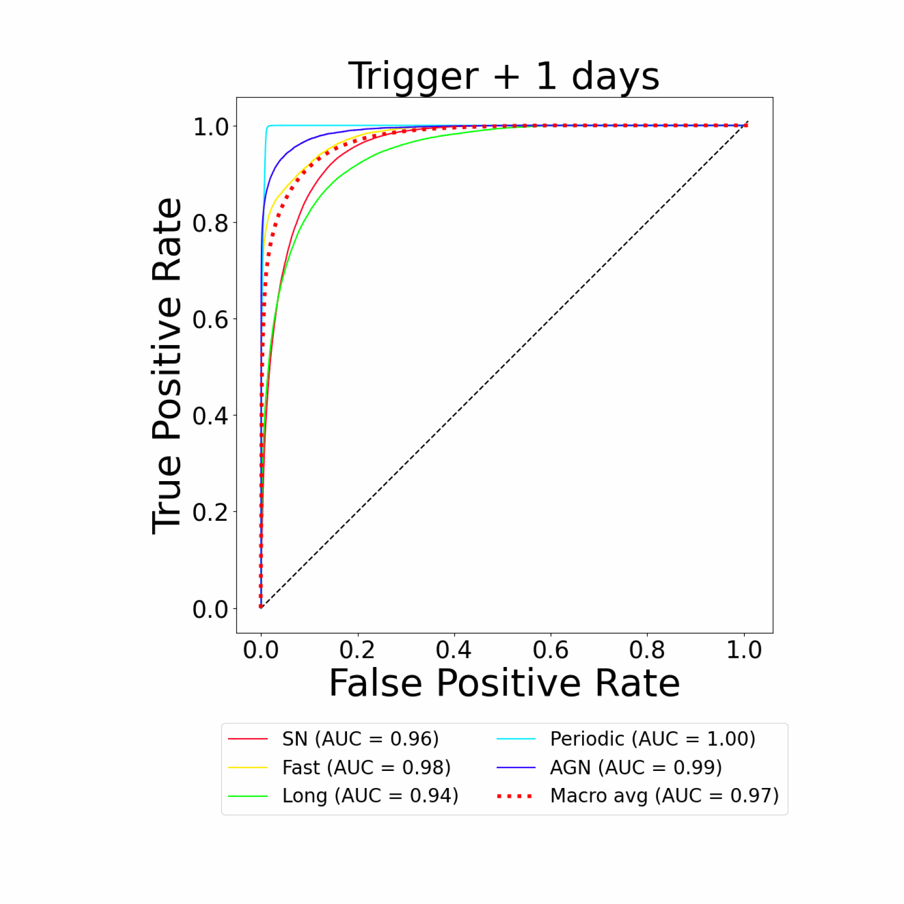
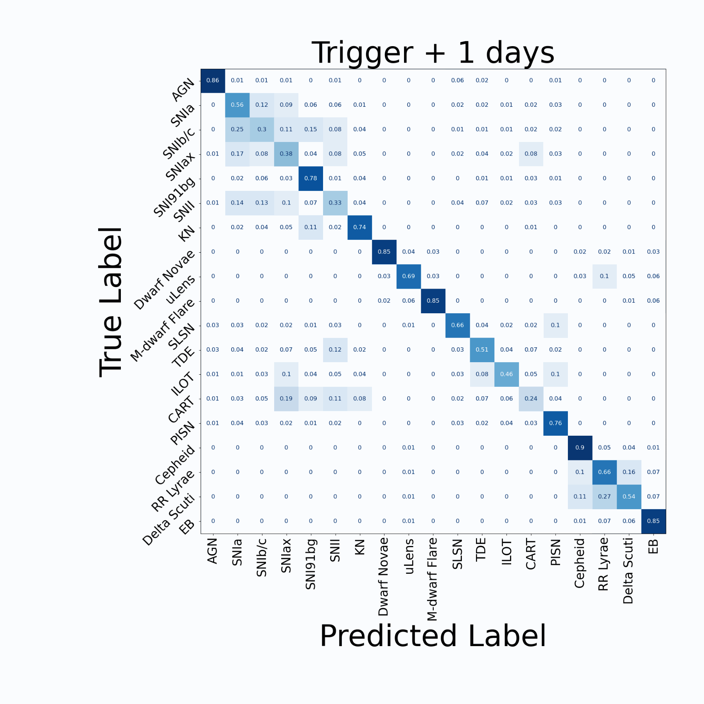
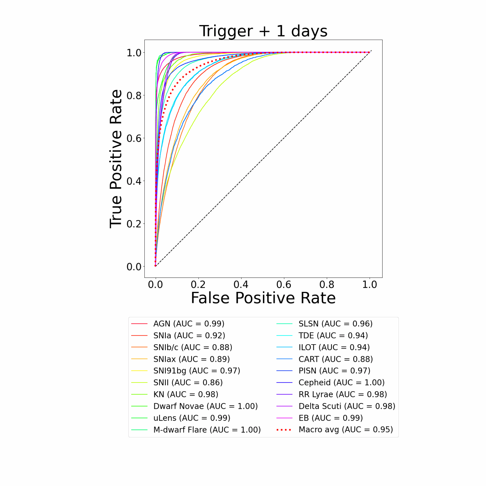

# ORACLE

[](https://arxiv.org/abs/2607.00228) 
[](https://arxiv.org/abs/2501.01496) 
[](https://dev-ved30.github.io/Oracle/) 
> [!NOTE]  
> This is a complete rewrite of the original Oracle codebase using PyTorch, and is meant to supersede it. If you are looking for the original repository, you can find it [here](https://github.com/uiucsn/Astro-ORACLE/tree/main).

This repository contains the code and resources for both **ORACLE-1** and **ORACLE-2**.

<!-- > [!WARNING]  
> ⚠️ This is a warning banner. Be careful! -->

<p align="center">
  
</p>


## ORACLE-1

ORACLE-1 is a hierarchical deep-learning model for real-time, context-aware classification of transient and variable astrophysical phenomena. ORACLE is a recurrent neural network with Gated Recurrent Units (GRUs), and has been trained using a custom hierarchical cross-entropy loss function to provide high-confidence classifications along an observationally-driven taxonomy with as little as a single photometric observation. Contextual information for each object, including host galaxy photometric redshift, offset, ellipticity and brightness, is concatenated to the light curve embedding and used to make a final prediction.

For more information, please read the our paper - https://ui.adsabs.harvard.edu/abs/2025arXiv250101496S/abstract

If you use any of this code in your own work, please cite the associated paper and software using the references in the [CITATION.cff](CITATION.cff) file.

## ORACLE-2

ORACLE-2 extends the original hierarchical classification framework to multimodal, real-time classification of transients and variables. The model family is designed to combine complementary information from multiple data sources:

* **ORACLE-2 Lite** uses light curves only, modeling the temporal evolution of each source.
* **ORACLE-2** combines light curves with tabular metadata to incorporate contextual information about the source.
* **ORACLE-2 Omni** combines light curves, metadata, and image cutouts to learn about the source and its local environment, including the surrounding host field.

These modalities play complementary roles throughout the evolution of an alert. Images and metadata can provide useful contextual information early, while the light curve supplies increasingly detailed information as more observations become available. The resulting models produce hierarchical classifications at different levels of granularity, supporting rapid triage and follow-up decisions on high-volume alert streams.

The ORACLE-2 models have also been demonstrated in real-time deployment on the Zwicky Transient Facility (ZTF) alert stream. For more information, see the [ORACLE-2 paper](https://arxiv.org/abs/2607.00228).


## Installation:

Please refer to the documentation [here](https://dev-ved30.github.io/Oracle/) for installation instructions.

## Classify a ZTF source by object ID

The `oracle-infer-ztf` command fetches a source's detections and reference cutout from the [Babamul/BOOM object API](https://github.com/boom-astro/babamul), applies the BTS preprocessing, and runs an ORACLE-2 checkpoint. Set a [Babamul API token](https://babamul.caltech.edu/signup) in your environment first:

```bash
conda activate VT
export BABAMUL_API_TOKEN="your_api_token"
PYTHONPATH=src python -m oracle.infer_ztf ZTF18abmrfqv --output prediction.json
```

Replace `your_api_token` with your actual token. If you saved the export in `~/.zshrc`, open a new terminal or run `source ~/.zshrc` before the command. Run this from the repository root. If you install the repository with `python -m pip install -e .`, you can use the `oracle-infer-ztf` command instead.

By default the command uses the **Omni** model (`BTSv2-pro`) at `models/BTSv2-pro/morning-feather-572/best_model_f1.pth`. It fills the reference-image channel for the latest alert's ZTF filter and leaves the other two image channels at zero, following `boom_scripts/boom_script_omni.py`. Use `--model BTSv2` for light curves plus metadata or `--model BTSv2-lite` for light curves only. To use another checkpoint of the selected architecture, pass `--checkpoint path/to/best_model_f1.pth`. These defaults are repository checkpoints; select the deployment checkpoint explicitly if you need to reproduce the deployed model's exact weights.

The output gives probabilities at each taxonomy level and lists contextual features that were unavailable in the broker response and set to the training sentinel value (`-9`). Upper limits and forced photometry are excluded, as in the BTS light curve loader. The metadata and Omni models may be less reliable when many contextual features are missing.

You can also classify a saved Babamul/BOOM alert JSON or a CSV file with one detection per row:

```bash
PYTHONPATH=src python -m oracle.infer_ztf path/to/alert.json --cutout path/to/cutouts.json
PYTHONPATH=src python -m oracle.infer_ztf path/to/detections.csv --model BTSv2-lite
```

For local Omni inference, `--cutout` accepts a Babamul cutouts JSON file containing `cutoutTemplate`, or a FITS/FITS.gz reference cutout. A source JSON containing `cutoutTemplate` needs no separate cutout file. Each detection needs `jd`, `magpsf`, `sigmapsf`, and `fid` (1, 2, 3) or `band` (`g`, `r`, `i`). The metadata and Omni models also need `ra` and `dec` in the latest detection. Missing contextual fields use `-9`; WISE magnitudes can be supplied in a top-level `static` object in JSON.

### Local web interface

The [`oracle_ui`](oracle_ui/) app lets you enter a ZTF object ID, choose ORACLE-2 Omni, ORACLE-2, or ORACLE-2 Lite, and fetch and classify it in one action. It shows an interactive light curve (scroll to zoom, drag to pan), source metadata, a Pan-STARRS1 color cutout, the ZTF reference image for Omni, and hierarchical classification probabilities. Advanced options in the search bar offer rolling classification, which is on by default: the model scores every successive observation and plots class probabilities over time; untick the switch to score only the final observation. For Omni, this reuses the latest ZTF reference image for all steps; current broker cross-matches are also reused. The hideable history sidebar saves completed results in this browser so they can be reopened without another broker request. The interface starts in dark mode and has a light-mode switch. Pan-STARRS1 images are retrieved separately from the [PS1 image service](https://spacetelescope.github.io/mast_notebooks/notebooks/PanSTARRS/PS1_image/PS1_image.html), so a missing image does not prevent classification. From the repository root:

```bash
conda activate VT
source ~/.zshrc
PYTHONPATH=src python -m oracle_ui.server
```

Open <http://127.0.0.1:8765> in your browser. The server listens on localhost and reads `BABAMUL_API_TOKEN` from its environment; the browser never receives the token. If Flask is missing from your environment, install the project dependencies with `python -m pip install -e .`.

## Repository structure

The repository contains the source code, data-processing tools, trained models, and analysis materials for both ORACLE-1 and ORACLE-2:

* `src/oracle/`: Core package code, including model architectures, training, testing, losses, taxonomies, dataset loaders, pretrained models, utilities, and visualization.
* `data/`: Datasets and prepared training, validation, and test splits.
* `models/`: Trained model checkpoints and experiment outputs for ORACLE-1 and ORACLE-2 variants.
* `scripts/`: Training, testing, hyperparameter sweep, data preparation, deployment, and documentation scripts.
* `notebooks/`: Exploratory analyses and scientific investigations.
* `paper_figures/`: Notebooks and intermediate outputs used to generate paper figures and tables.
* `figures/`: Figures used in the README and project documentation.
* `docs/`: Source and generated project documentation.
* Root-level files such as `pyproject.toml`, `CITATION.cff`, `LICENSE`, and `README.md`: Package metadata, citation information, licensing, and project documentation.

## ELAsTiCC data

The data used to train and evaluate the ELAsTiCC models are available in [this Google Drive folder](https://drive.google.com/drive/folders/1M28MSkyVPL-YcONiBcIWLw24xHLSOBw-). To download them into `data/ELAsTiCC/`, run from the repository root:

```bash
python -m pip install gdown
bash scripts/download-elasticc.sh
```

The script can be rerun to resume interrupted downloads and skip completed files. The dataset loader expects `train.parquet`, `val.parquet`, and `test.parquet` directly in `data/ELAsTiCC/`.

## ZTF data

The public ZTF dataset is available in [this Google Drive folder](https://drive.google.com/drive/folders/1g7KBbTqmSHshTd3u-hruWfALEzJ6bvqi?usp=drive_link). Download its train, validation, and test splits into `data/BTSv3/` with:

```bash
python -m pip install gdown
bash scripts/download-ztf.sh
```

The BTS dataloaders expect `train_PS_ZTF.parquet`, `val_PS_ZTF.parquet`, and `test_PS_ZTF.parquet` directly in `data/BTSv3/`. The script resumes partial downloads and skips existing files. If those splits are already present and you want the public versions, move the existing files elsewhere before running it.

> [!WARNING]
> The ZTF models reported in the ORACLE-2 paper were trained on both public and partnership data. This download contains only public data, so results from training or evaluating on it will not exactly match the paper, though you should expect the same overall trends.

# Classification Taxonomy

There is no universally correct classification taxonomy - however we want to build something that is able to best serve real world science cases. For obvious reasons, the leaf nodes need to be the true class of the object however what we decide for nodes higher up in the taxonomy is ultimately determined by the science case. 

For this work, we are implementing a hierarchy that will be of interest to the TVS (Transient and Variable star) community since it overlaps well with the classes of the elasticc data set. The exact taxonomy used is shown below:



A trap we wanted to avoid was mixing different "metaphors" for classification. For instance, we decided against using `Galactic vs Extra galactic` classification since we would be mixing a spatial distinction with temporal ones (like `Periodic vs Non periodic`). This makes the problem trickier since some objects, like Cepheids, can be both galactic and extragalactic which would result in an artificial inflation in the number of leaf nodes without adding much value to the science case.

*Note:* There is some inconsistency around the Mira/LPV object in the elasticc documentation however we have confirmed that this object was removed for the elasticc2 data set that we use in this work.

# Machine learning architecture



Once again, we have much more detailed discussion in the paper.

# Found Bugs?
We appreciate any support in the form of bug reports in order to provide the best possible experience. Bugs can be reported in the `Issues` tab.

# Contributing
If you like what we're doing and want to contribute to the project, please start by reaching out to the developer. We are happy to accept suggestions in the Issues tab. 

# Some cool results:

Overall model performance:




First at the root,




At the next level in the hierarchy




And finally, at the leaf...




## References:
* ORACLE-1 - https://arxiv.org/abs/2501.01496
* ORACLE-2 - https://arxiv.org/abs/2607.00228
* HXE Loss Function - https://arxiv.org/abs/1912.09393
* WHXE Loss Function - https://arxiv.org/abs/2312.02266
